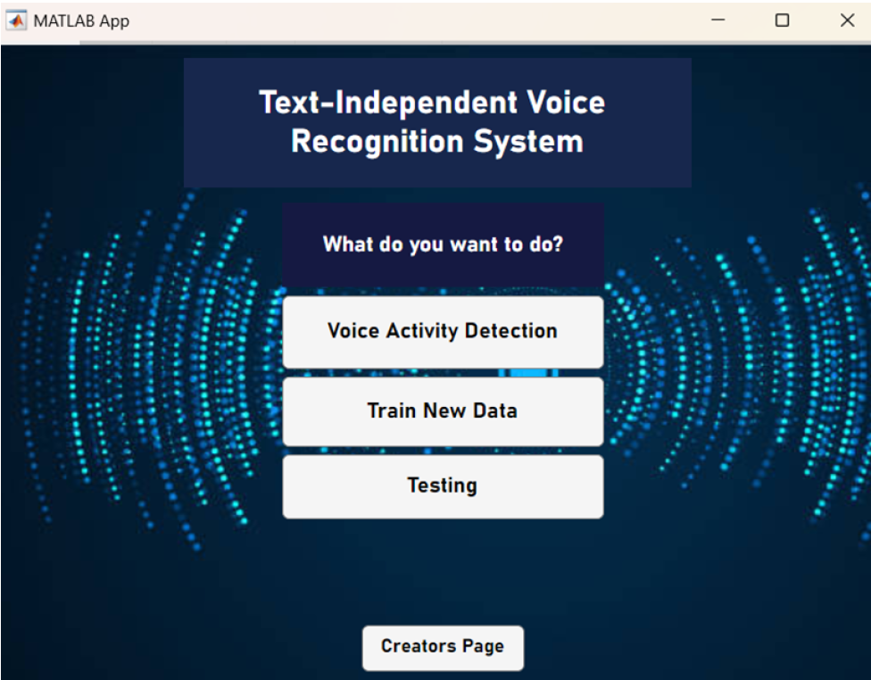
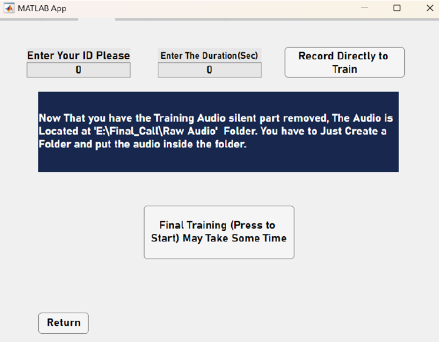
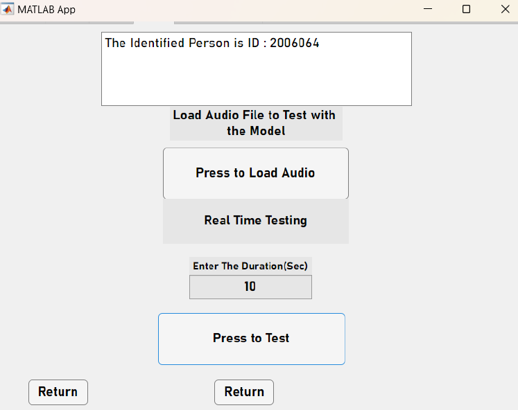

# Text-Independent Speaker Recognition System

**Course:** Digital Signal Processing Laboratory  
**Domains:** Digital Signal Processing (DSP), Speech Recognition, Machine Learning, GUI Development  

## Project Overview
This project presents a text-independent speaker recognition system designed to enhance facility security by granting access only to authorized personnel. Unlike text-dependent systems, this model performs speaker identification regardless of the words spoken, making it more flexible for real-world access control applications. The system processes input audio, compares it against stored speaker characteristics, and classifies the speaker based on feature similarity.

## Key Features
* **Text-Independent Recognition:** The system does not require the speaker to recite specific phrases, allowing for natural voice interaction.
* **Closed/Open Set Identification:** The model supports both closed-set identification (where all speakers are known) and open-set identification (which can detect unknown/unauthorized speakers).
* **Threshold-Based Security:** The system compares input voice characteristics against stored profiles; if the similarity score exceeds a predefined threshold, access is granted.
* **Interactive GUI:** A custom Python GUI was developed to manage the entire workflow, from audio training samples to real-time testing.

## Methodology & DSP Techniques
The system utilizes advanced signal processing techniques to extract unique vocal characteristics:
* **Feature Extraction:** Employs Mel-Frequency Cepstral Coefficients (MFCC) to represent the short-term power spectrum of speech.
* **Classification:** Uses Improved Weighted Vector Quantization (IWVQ) to discriminate between voiced and unvoiced segments of speech signals.

## Software Interface (GUI)
The custom-built GUI provides an intuitive platform for training the recognition model and conducting real-time speaker tests.

| Home Screen | Training Module | Testing Module |
| :---: | :---: | :---: |
|  |  |  |
